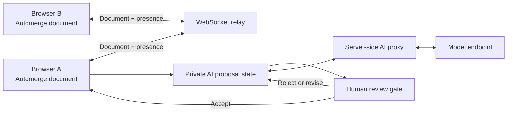

# Fluid Framework — Research & Prototyping

**A product-decision study: should Fluid v2 / SharedTree remain the default collaboration foundation for Microsoft's AI-era artifacts?**

**Owner:** Gin Fu — product framing and decision, plus the engineering prototype that tests it 
**Scope:** Fluid v2 / SharedTree, evaluated against Yjs, Automerge, Loro, and Liveblocks — for durable artifacts that people and AI agents edit together

**Conclusion —** keep Fluid v2 / SharedTree as the default. Across the two layers that decide the outcome — the collaboration mechanism at the client, and the trusted platform beneath it — no external framework offers an advantage large enough to justify rebuilding what Fluid already provides. A deployed prototype backs it with evidence rather than assertion.

| Resource | Link | What's in it |
|---|---|---|
| **Live AI collaborative canvas** | [Open the showcase](https://fluid-showcase-gin-fnb4haeufyhddedt.centralus-01.azurewebsites.net/?demo=playground) | The deployed canvas: shared rooms, presence, AI proposals, and human-controlled commit |
| **Competitive analysis** | [research/Fluid-Framework-Analysis.md](research/Fluid-Framework-Analysis.md) | The complete decision record: context, requirements, evaluation model, per-framework comparison, prototype evidence, and investment priorities |
| **Prototype source** | [prototype/](prototype/) | React + TypeScript client, Automerge state, WebSocket relay, AI proxy, review workflows, semantic-conflict logic, and validation scripts |
| **Prototype guide** | [prototype/README.md](prototype/README.md) | Architecture, setup, AI-backend configuration, and evidence boundaries |

---

## The question

For a new collaborative AI-artifact experience, should Fluid v2 / SharedTree remain the default — or does an external framework (Yjs, Automerge, Loro, or Liveblocks) create enough advantage to justify a different platform path?

To answer it, I pair a competitive analysis of Fluid against the leading external frameworks with a counterfactual prototype — an AI-collaborative artifact built on an external mechanism — that validates the comparison in working code, not just on paper.

---

## Why this decision matters now

In the AI era, collaboration is no longer only people synchronizing edits. It is people and agents co-editing a durable artifact — a page, a canvas, a plan, a task list — that keeps evolving after the model responds. Once an agent can change the same object a person depends on, the collaboration foundation stops being plumbing: it becomes the boundary of what AI can safely edit, what people can trust, and what the product can govern and recover.

That makes the choice of foundation a strategic decision, not an implementation detail. For the AI-artifact scenario, four requirements weigh most — and they are precisely the ones that are expensive to add later:

- **Structured, targetable state** — AI addresses a section, a task, or an object, not a flat blob of text.
- **Reviewable edits** — propose, review, commit; nothing an agent writes lands unseen.
- **Durable lifecycle** — the artifact persists, evolves, and recovers beyond a single session.
- **Microsoft integration** — identity, storage, governance, audit, search, and compliance all apply.

---

## Evaluation Model

A product team does not ship a merge algorithm; it ships a complete system. The right unit of comparison is therefore not the library but the entire adoption path:

> **Fluid**, plus the Microsoft integration it already has — versus an **external framework**, plus the equivalent integration that would still have to be built.

Two principles govern the evaluation:

- **Mechanism value** — the collaboration and AI behavior an engine actually enables at the application layer.
- **The replacement bar** — an external framework should displace Fluid only if its mechanism advantage is large enough to justify rebuilding the Microsoft platform beneath it.

Every candidate is judged on two layers, and must clear both.

| Layer | The question it answers | What the evidence must show |
|---|---|---|
| **Mechanism / client** | What can the application deliver? | Data-model fit, merge behavior, history, text, presence, AI review, developer experience |
| **Product / platform** | What must Microsoft build, trust, deploy, and operate? | Identity, storage, governance, recovery, search projection, regional deployment, reliability, ownership |

The decision question is not *"which engine has more features"* but *"which complete path produces the strongest product outcome at an acceptable cost."*

---

## The mechanism layer: strong engines, narrow advantages

Fluid v2's collaboration mechanism is **SharedTree**, a typed-tree data model in which the artifact is structured, schema-constrained state that both people and AI can target — not flat text. It is the incumbent this study tries to evaluate.

The real-time collaboration ecosystem has evolved quickly in recent years: each modern CRDT engine below can reproduce the baseline — multi-user sync, conflict-free merge, presence, and offline. So the real mechanism question is not *"can an external engine do live collaboration?"* — they can — but *"which mechanism best fits a durable, reviewable, AI-editable artifact?"* On that narrower question each external engine leads in a single dimension, while SharedTree is built for the whole of it.

| Engine | What it is | Where it leads | Why that lead is too narrow to switch on |
|---|---|---|---|
| **Yjs** | Text-first CRDT with mature editor bindings | Collaborative text and the editor ecosystem | The scenario also needs typed objects, review state, and AI-addressable nodes — outside Yjs's center of gravity |
| **Automerge** | Local-first document CRDT | History and merge across clients | On its own, no typed tree, schema, or constraints for reviewable AI edits |
| **Loro** | CRDT with a genuinely movable tree | Move and delete conflict handling | A single dimension of the problem, not the whole scenario |
| **Liveblocks** | Hosted service wrapping Yjs | Packaging, presence, and developer velocity | Faster packaging is not a stronger underlying mechanism |
| **SharedTree** (Fluid) | Typed tree with schema, transactions, and branch/rebase | The full loop — a typed node to target, constraints that keep an edit valid, and review before commit | The structure the scenario needs is native, not something the product team must build and own |

At the mechanism layer, baseline collaboration is broadly achievable, so the strongest case for SharedTree is not that a central service is always better. It is that service ordering, optimistic local edits, transactions, schema, and structured state form a coherent model for governed Microsoft artifacts — and for human–agent workflows, that coherence is what matters. An AI proposal can target a node, confirm the referenced state still exists, produce a reviewable change, and commit only after human acceptance: one continuous loop, native to the model rather than assembled on top of a merge engine.

---

## The platform layer: where the real cost lives

An external CRDT delivers the visible surface of collaboration — real-time sync, conflict-free merge, local persistence, and presence. That surface is necessary, but it is not what makes collaboration trustworthy inside a Microsoft product.

The cost that decides the outcome sits beneath that surface: the platform a production experience cannot ship without.

- Entra identity and permissions, acting on behalf of real users and policies
- SharePoint / ODSP storage, sharing, sensitivity labels, and audit
- Compliance, eDiscovery, and search projection
- Recovery, regional deployment, and a live service with clear ownership

Fluid already carries this weight; an external framework would have to rebuild it. Persisting CRDT bytes to a file is storage — not a live collaboration service with ordering, recovery, projection, and governance. This asymmetry — modest, visible mechanism value above the line against substantial, hidden platform cost below it — is what sets the replacement bar high.

---

## Recommendation

**Keep Fluid v2 / SharedTree as the default** for Microsoft-internal collaborative canvas and AI-artifact scenarios.

No external mechanism advantage found in this study is large enough to offset the Microsoft integration that would still have to be built. Fluid leads on both layers: its structured state is native at the mechanism layer, and identity, storage, and compliance are already integrated at the platform layer.

External frameworks are not strawmen — they are useful design pressure, and they mark precisely where Fluid should keep investing:

- A first-class rich-text path (Yjs's strength)
- A canonical, documented pattern for how Copilot proposes and commits edits to a Fluid artifact
- Faster first-feature developer experience (Liveblocks's strength)
- Stronger history and recovery, and explicit structural-conflict handling (Automerge's and Loro's strengths)

The strategic conclusion is straightforward: the demo is easy to reproduce; the trusted product path is not — and that path is Fluid's durable advantage.

---

## Evidence: a working counterfactual

To keep the recommendation grounded in evidence rather than assertion, the study includes a deployed prototype: a collaborative canvas built on **Automerge** — the strongest external counterfactual — and hosted on Azure App Service. It follows the mechanism argument in two steps: first confirm that an external engine can reproduce the baseline, then push past the baseline into the part that is still unsolved — durable human–AI collaboration.

### Step 1 — Confirm the baseline: external mechanisms reproduce human-to-human collaboration

The first step tests whether the external path is real: multi-user, real-time collaboration with no Fluid server. Each browser holds an Automerge document; a stateless WebSocket relay only forwards messages, while merge and convergence happen on the client. On that base the prototype implements the surface expected of a live session:

- Shared sticky notes, shapes, ink, and a long-form text surface
- Presence, live cursors, selections, and remote carets
- Multi-user and multi-tab convergence, local persistence, offline and reconnect, and room reset
- Inverse-operation undo/redo that does not revert another user's concurrent edit

**Finding —** an external CRDT plus a thin relay reproduces baseline human-to-human collaboration convincingly. That is the crux of the mechanism argument: because live sync is now reproducible, it cannot be the deciding advantage. The decision has to be made where the difficulty still lives — durable human–AI collaboration, and the platform beneath it.

### Step 2 — Push into the frontier: durable human–AI collaboration

Baseline sync is solved. The open problem is how a person and an agent can co-own a durable artifact over time without the AI silently overwriting shared state. To explore that frontier, the prototype implements two forward-looking patterns, each pointing at a capability the next generation of AI products will need.

**1. A reviewable proposal that remembers, not blind trust.** The AI branches a private draft from the shared state, then refines it from your local feedback before anything lands — nothing the agent writes reaches the shared artifact until a person accepts it.
*Why it matters —* every rejection teaches the next proposal, so the agent keeps contributing to a shared artifact without ever silently overwriting it — and review stays sustainable instead of exhausting. It maps directly onto SharedTree's branch/rebase and transactions.

**2. A proactive teammate, not an order-taker.** An LLM judge continuously watches the artifact for multi-user conflicts — where different users' edits semantically contradict each other, or a note drifts against its own earlier state — then, in one click, drafts a source-traced merge for human review.
*Why it matters —* most AI editing today waits to be told what to do. An agent that notices problems on its own, and cites its sources so a person can trust and decide in seconds, is how AI begins to carry real weight in a long-lived, shared artifact.

**Finding —** the durable pattern for human–AI collaboration is *private proposal → human review → accepted commit*, and the higher-value role for AI is proactive, source-traced, and reviewable. Both capabilities live in application logic above the CRDT — which is exactly the point: they are the structured, reviewable behaviors SharedTree makes native, and that an external engine would have to rebuild from scratch.

### Architecture

Automerge supplies replicated state, merge, and convergence. Everything that made the experience good — the relay topology, presence, private proposal state, the structured edit contract, the review workflow, feedback memory, and semantic detection — is application architecture above Automerge, not native to it.

### What the build revealed

The prototype shows that a third-party CRDT can produce credible client-side collaboration and AI-review behavior quickly. That matters because the external path is not theoretical — the comparison has to be taken seriously, not dismissed. But the build also exposes the limits: convergence is only the baseline; undo, presence, reset, longevity, and review boundaries are still real application work, and persisting CRDT bytes is storage, not a live service with ordering, recovery, projection, and governance.

The more durable lesson is a product pattern: the right way for AI to touch a shared artifact is private proposal, human review, accepted commit, and visible source and decision context — not direct mutation. That pattern is independent of the engine, and it is exactly what Fluid's typed, transactional, reviewable model makes native.

The prototype makes the asymmetry concrete: the merge is the straightforward part; the trusted product path is the real replacement bar.
