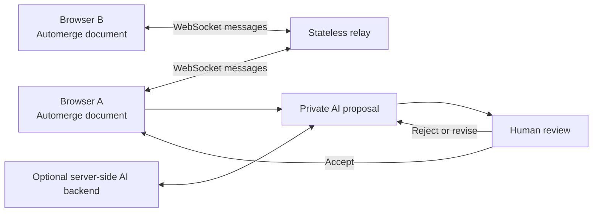

# Collaborative Canvas and AI Review Prototype

This React and Automerge prototype tests how far an external CRDT can support a collaborative canvas and a human-controlled AI editing workflow.

## What it demonstrates

- Shared sticky notes, shapes, and ink.
- Multi-user synchronization through a small WebSocket relay.
- Browser-local persistence.
- Presence, cursors, selections, and remote carets.
- Canvas and long-form shared-text surfaces.
- Inverse-operation undo/redo for canvas actions.
- Private AI proposal preview before shared mutation.
- Accept, reject, partial accept, and reject-and-revise workflows.
- Cross-note semantic review and same-note live-conflict preview.
- Human acceptance as the boundary for committing AI changes.

## Architecture



Each browser keeps an Automerge document. The relay forwards document and presence messages; clients perform merge and convergence locally. AI proposals remain private application state until a reviewer accepts them into the shared document.

The current demo broadcasts the full serialized Automerge document after each canvas change. This is intentionally simple for a small prototype; it is not the recommended transport design for large or long-lived production documents.

## Run locally

Requirements:

- Node.js 20 or newer.
- npm.

Install and start the Vite app plus relay:

```powershell
npm ci
npm run dev:all
```

Open:

```text
http://localhost:5173/?demo=playground
```

Use the same room name in a second browser or tab to test collaboration.

## AI generation

AI is optional. Collaboration works without it.

During local Vite development, `/ai-proxy` defaults to `http://localhost:6011`. Change that target in [vite.config.ts](vite.config.ts) if using another OpenAI-compatible local service.

For a production build, [server.mjs](server.mjs) can proxy to one of these server-side configurations:

### OpenAI-compatible endpoint

```text
OPENAI_API_KEY=<server-side secret>
OPENAI_BASE_URL=https://api.openai.com
OPENAI_MODEL=<model name>
```

### Azure OpenAI

```text
AZURE_OPENAI_API_KEY=<server-side secret>
AZURE_OPENAI_ENDPOINT=https://<resource>.cognitiveservices.azure.com
AZURE_OPENAI_DEPLOYMENT=<deployment name>
AZURE_OPENAI_API_VERSION=<supported API version>
```

### Existing proxy

```text
AI_PROXY_TARGET=https://<openai-compatible-backend>
```

Do not place API keys in frontend code or commit environment files.

## Production-style local run

```powershell
$env:VITE_PUBLIC_SHOWCASE = "1"
$env:VITE_AI_LIVE = "0"
npm run build
$env:PORT = "4173"
npm start
```

Open `http://localhost:4173/?demo=playground`.

Set `VITE_AI_LIVE=1` before building only when a server-side AI backend will be configured at runtime.

## Validation commands

```powershell
npm run lint
npm run build
npm run smoke:relay
npm run smoke:semantic-merge
```

The scripts in [scripts/](scripts/) cover relay health and forwarding plus the semantic-review structure guard. The AI output itself still requires a compatible backend and human or browser-level review.

## Important implementation boundaries

### Automerge provides

- Replicated document state.
- Deterministic merge and convergence.
- Change history and document-level collaboration primitives.

### Application code provides

- WebSocket transport and rooms.
- Presence and caret awareness.
- AI prompts and structured edit contracts.
- Private proposal state.
- Partial acceptance and feedback memory.
- Semantic tension detection and LLM-generated resolution.
- The human review and commit workflow.

Semantic review is therefore an application and AI workflow over Automerge-backed state, not a native Automerge capability.

## What this prototype does not prove

- Production-scale reliability or performance.
- Durable server-side document storage.
- Microsoft Entra identity or permission enforcement.
- SharePoint/ODSP integration.
- Audit, eDiscovery, retention, compliance, or regional deployment.
- That Automerge should replace Fluid Framework.

The prototype is evidence for client-layer feasibility and product interaction patterns. The broader adoption decision is discussed in [../research/Fluid-Framework-Analysis.md](../research/Fluid-Framework-Analysis.md).